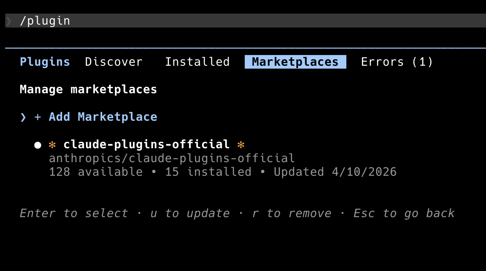

# claude-warp-team-agents

> **Platform: macOS only** — Linux and Windows contributions welcome! See [CONTRIBUTING.md](CONTRIBUTING.md).

Claude Code plugin that automatically splits Warp terminal panes for Agent Teams teammates.


Each time the team lead spawns a teammate, a new Warp pane opens:

```
[Main Claude (team lead)] | [Teammate 1]
                          | [Teammate 2]
                          | [Teammate 3]
```

## Requirements

- macOS
- [Warp terminal](https://www.warp.dev/)
- `jq` — `brew install jq`
- Claude Code with Agent Teams enabled

## Installation

### 1. Add the marketplace

In Claude Code, run `/plugin` and navigate to the **Marketplaces** tab. Select **+ Add Marketplace** and enter:

```
codercodingthecode/claude-warp-team-agents
```



### 2. Install the plugin

After adding the marketplace, go to the **Installed** tab and install `claude-warp-team-agents`. Or run:

```bash
/plugin install claude-warp-team-agents
```

### 3. Set the teammate command

Add to `~/.claude/settings.json` under `env`:

```json
{
  "env": {
    "CLAUDE_CODE_EXPERIMENTAL_AGENT_TEAMS": "1",
    "CLAUDE_CODE_TEAMMATE_COMMAND": "~/.claude/plugins/claude-warp-team-agents/hooks/lib/warp-teammate.sh"
  }
}
```

> **Note:** After installing the plugin, run `/plugin list` to find the exact
> installation path and adjust the `CLAUDE_CODE_TEAMMATE_COMMAND` path accordingly.

### 4. Grant Accessibility permissions

The plugin uses AppleScript to drive Warp's keyboard shortcuts. macOS requires
accessibility access:

1. Open **System Settings → Privacy & Security → Accessibility**
2. Add **Warp** to the allowed list

## How it works

Claude Code reads `CLAUDE_CODE_TEAMMATE_COMMAND` to find the executable when
spawning teammates. This plugin's wrapper script (`warp-teammate.sh`) intercepts
each spawn: it opens a Warp split pane and runs the real `claude` binary there
with all the original teammate flags.

Agent communication is file-based (mailbox system), so teammates work correctly
in Warp panes without tmux.

### Model resolution

Teammates inherit the parent session's model unless overridden:

1. **User-defined agent** (`~/.claude/agents/<name>.md` with `model:` frontmatter) → uses that model
2. **Parent session model** (from `~/.claude/settings.json`) → uses that model
3. **Caller's model** → used as-is if neither above is found

### Pane layout

- First teammate: vertical split (CMD+D) — creates right column
- Further teammates: horizontal split in the right column (CMD+SHIFT+D)
- Concurrent spawns are serialized with a file lock to prevent race conditions

### Verify + retry

AppleScript Return key is unreliable in Warp's block-based input model. The
plugin verifies execution by checking if the launcher script was consumed
(it self-deletes on start), and retries Enter with pane navigation if needed.

## Usage

Start Claude Code in Warp. Tell the team lead to create a team and spawn
teammates:

```
Create a team and use teammates to build [your task] in parallel.
```

Each teammate automatically opens in a new Warp split pane.

## Fallback mode

If `CLAUDE_CODE_TEAMMATE_COMMAND` is not set, the PostToolUse hook fires after
the teammate is already running in tmux. It reads the teammate's process from
the tmux pane, kills the pane, and restarts the teammate in a Warp split.

## Non-Warp terminals

The plugin exits silently when not running in Warp. Agent Teams falls back to
normal tmux operation.

## Troubleshooting

- **Pane opens but command doesn't run:** Check Accessibility permissions (step 3).
- **Nothing happens:** Verify `CLAUDE_CODE_TEAMMATE_COMMAND` points to the
  wrapper. Run `/plugin list` to confirm the plugin is installed.
- **Teammate still in tmux:** `CLAUDE_CODE_TEAMMATE_COMMAND` is not being
  picked up. Restart Claude Code after updating settings.
- **Second pane needs manual Enter:** Increase retry tolerance — the plugin
  retries up to 15 times, but slow machines may need more time.

## Running tests

```bash
bash tests/run_tests.sh
```

## License

MIT
